# Project 0: Hello Unity

**Due:** Friday, September 6, 2019 at 4:59:59 AM EDT

This project will take you through setting up your development environment as well as teach you some of the basics of opening an existing project, creating a new project from scratch, and building and deploying a project to your phone.

## Getting Your System Ready

### Creating Your Unity ID

Create your Unity ID account at https://id.unity.com/.

### Installing the Unity Hub

Go to https://unity3d.com/get-unity/download and click on the _**Download Unity Hub**_ button. This will start the download for the installer executable file. Launch the Unity Hub once you have finished installing it.

### Activating Your License

Since this is your first time opening the Hub, you will land up at the _**License Management**_ page with a notification message stating, "_You have no valid license._" Click on the profile icon in the upper right corner and sign in to your Unity ID account.

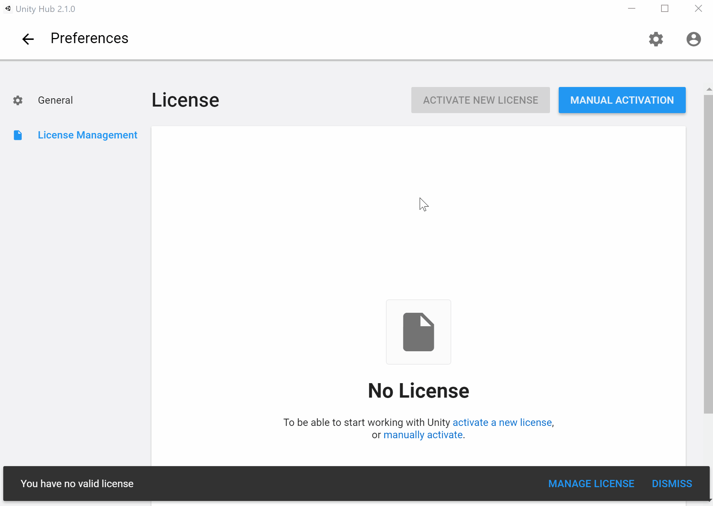

Once you are logged in, you will see that the _**Activate New License**_ button is no longer disabled. Click this button and select _**Unity Personal**_.

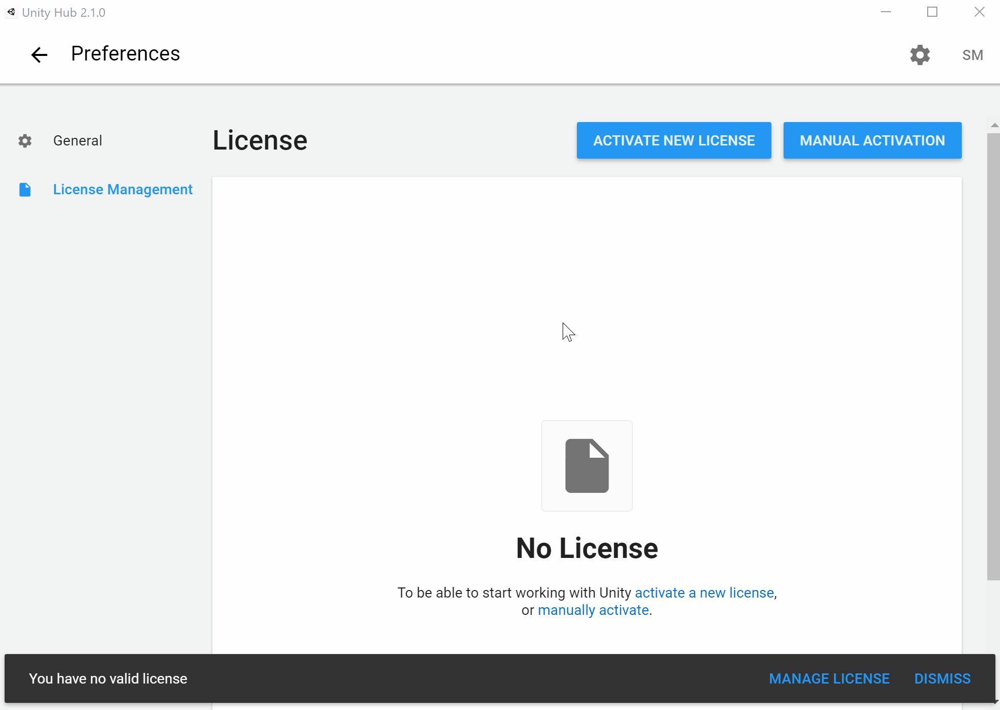

### Installing the Unity Editor

_Note: This step could take 30 mins or longer. I would recommend finding something else to do while it downloads and installs in the background._

Click the back button to go to the Hub's main page. Then go to the _**Installs**_ tab and click on the _**Add**_ button. Select the latest official release of Unity and click _**Next**_ to select the modules you want to add. Here is some info about modules of interest for this class:

* Microsoft Visual Studio Community 2019 / Visual Studio for Mac **(Recommended, but optional)**
  - This is the default and recommended code editor for Unity. For more info on supported code editors, see [the next section](#supported-code-editors).
  - If you already have VS 2019 or VS for Mac installed, you should still keep this module checked. It will not add a redundant VS instance but will modify your existing installation to include _**Visual Studio Tools for Unity**_ if you don't already have it installed and will leave it untouched if you do.
  - If you have an older version of Visual Studio installed that you'd like to use instead, uncheck the Visual Studio module in the Unity Hub. Instead open up the Visual Studio installer (should already be installed if you have a VS instance) and modify your existing instance to include the _**Game development with Unity**_ workload. Make sure to uncheck the optional _**Unity 201x.x 64-bit Editor**_ on the installation details, since it is not the most up-to-date version of Unity and we'll be installing Unity separately via the Hub.
* Android Build Support **(Required)**
  - For some of the projects, you will be building and submitting an apk file in addition to your code itself to make it easier for us to test and grade your project. The Android build support module requires a Java JDK and the Android SDK to be installed on your machine. Even if you already have a Java JDK instance on your computer and may have previously installed an Android SDK via Android Studio, it is _**strongly recommended**_ that you install these items via the Unity Hub. Differing JDK and Android SDK versions are often the source of many unexpected and avoidable configuration errors in Unity. Note that installing these via the Hub _will not_ modify your external configurations, as they will just be an additional instance of the JDK and Android SDK to be used solely by Unity.
* iOS Build Support **(Optional)**
  - Select this if you have an iPhone that you would like to build and test your projects on. When you build an iOS project in Unity, it generates an Xcode project that you can then open with the Apple Xcode IDE to deploy to your iOS device. Note that while you can build and generate the Xcode project on Windows systems, the Xcode IDE is only available on Macintosh computers, so you must have a Mac to actually deploy it to an iOS device.

You may have to accept additional terms and conditions before the installation starts. If you are installing this version of Visual Studio on your computer for the first time, make sure to restart your computer after everything finishes installing.


### Supported Code Editors

Unity supports the following C# IDEs. Make sure you have at least one of them installed.

* [Visual Studio IDE](https://visualstudio.microsoft.com/vs/)
  - This is the default and recommended IDE for Unity scripts and is automatically included by default in your Unity installation.
* [Visual Studio Code](https://code.visualstudio.com/)
  - A popular, lightweight code editor by Microsoft.
* [Rider](https://www.jetbrains.com/rider/)
  - A C# IDE by JetBrains. Its interface is similar to the company's other IDEs, like IntelliJ for Java and PyCharm for Python, and Android Studio, which is powered by IntelliJ.

### Git Requirements

Make sure your computer has both [Git](https://git-scm.com/) and [Git Large File Storage (LFS)](https://git-lfs.github.com/) installed.

## Infinite Runner Game

In this section, you will be building and deploying an open-source [endless running platformer](https://en.wikipedia.org/wiki/Platform_game#Endless_running_game) to your phone. The source code can be found at https://github.com/Oriik/InfiniteRunner2D_Mobile. Credits to [Oriik](https://github.com/Oriik/) for this amazing game.

### Obtaining the Project

You can obtain a copy of the project on your PC in one of two ways:

* Open up a terminal window, navigate to the location you would like the project in, and enter the following command `git clone https://github.com/Oriik/InfiniteRunner2D_Mobile.git`.
* Go to the aforementioned GitHub link, download the zip of the repo, and extract the files to a location on your computer.

### Opening the Project

Open up the Unity Hub, make sure you are on the _**Projects**_ tab, and click on the _**Add**_ button. Then, use the file explorer to navigate to and select the project folder. You should now see the project listed in the _**Projects**_ tab. Since this is first time you are opening up this project, you should select _**Android**_ as your _**Target Platform**_, otherwise it will open and import all the assets for the Unity default platform (_**PC, Mac & Linux Standalone**_). In subsequent openings, this is not necessary, as it will already open using your most recent target platform for the project.

Go ahead and click on the row to launch the project. Since it was created with an older version of Unity, you will be asked if you would like to upgrade your project. _NOTE: Unity does not support downgrading projects to run on older Unity versions._

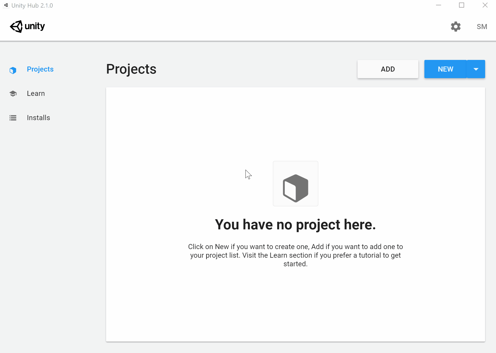

### Connecting Your Phone

You will need to have _**Developer Options**_ and _**USB debugging**_ enabled on your Android phone in order to install apps from your computer. Instructions on how to do this can be found on the [Android Developers site](https://developer.android.com/studio/debug/dev-options#enable). _NOTE: Instructions may vary slightly depending on your phone model and Android OS version._

Once you have done this, connect your phone to your computer with your cable. You should see a pop up on your phone that asks whether you want to allow USB debugging along with your computer's RSA key fingerprint. Go ahead and click _**OK**_.

### Building and Deploying the Project

Navigate to _**File**_ -> _**Build Settings**_ and in the new window that pops up, click on the _**Build And Run**_ button. Create a "Build" folder and save your apk in there as `LastName_FirstName_InfiniteRunner.apk`. It is good practice to store your builds in a "Build" or "Builds" folder, as anything in those folders are ignored by Git with the default Unity `.gitignore` file. Once the project has finished building, it will automatically install and launch on your phone. Enjoy the game!

If you don't have an Android phone, you can still build the apk without deploying to an actual device by clicking the _**Build**_ button instead of the _**Build And Run**_ button. If you have an iPhone that you would like to test the game on as well, click on the _**iOS**_ platform in the _**Build Settings**_ window, click on the _**Switch Platform**_ button, and then refer to the [Unity docs](https://docs.unity3d.com/Manual/iphone-GettingStarted.html) for further steps on building and deploying to iOS.

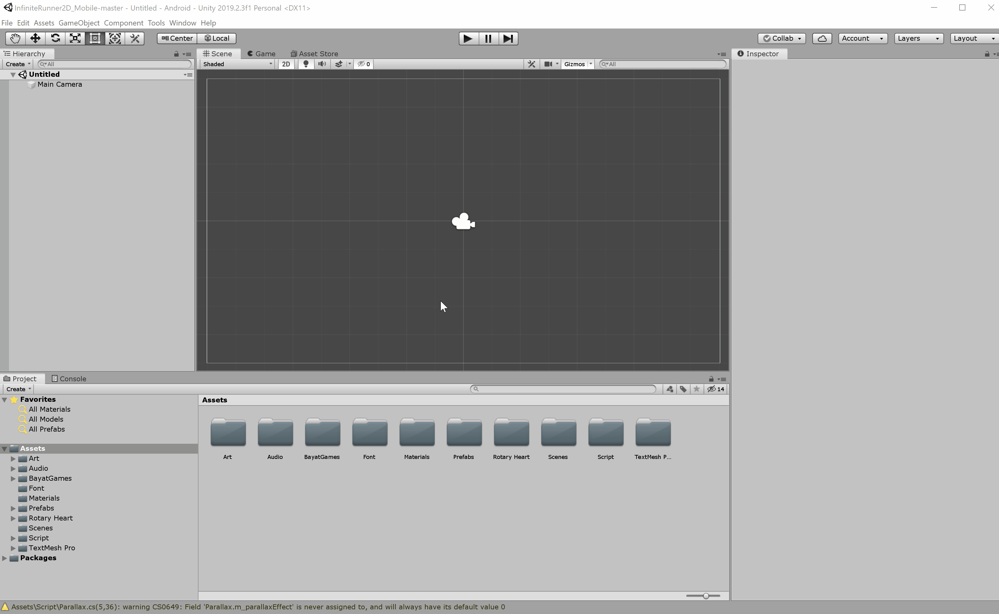

Here is what the game should look like on your phone:

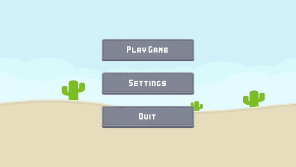

## Spinning Cube

In this section, you will be creating a your own project from scratch.

### Creating a New Project

Open up the Unity Hub, make sure you are on the _**Projects**_ tab, and click on the _**New**_ button. In the new window that pops up, make sure the _**3D**_ template is selected and enter "Spinning Cube" as the project name. Select a new location to save your project in, if you would like.

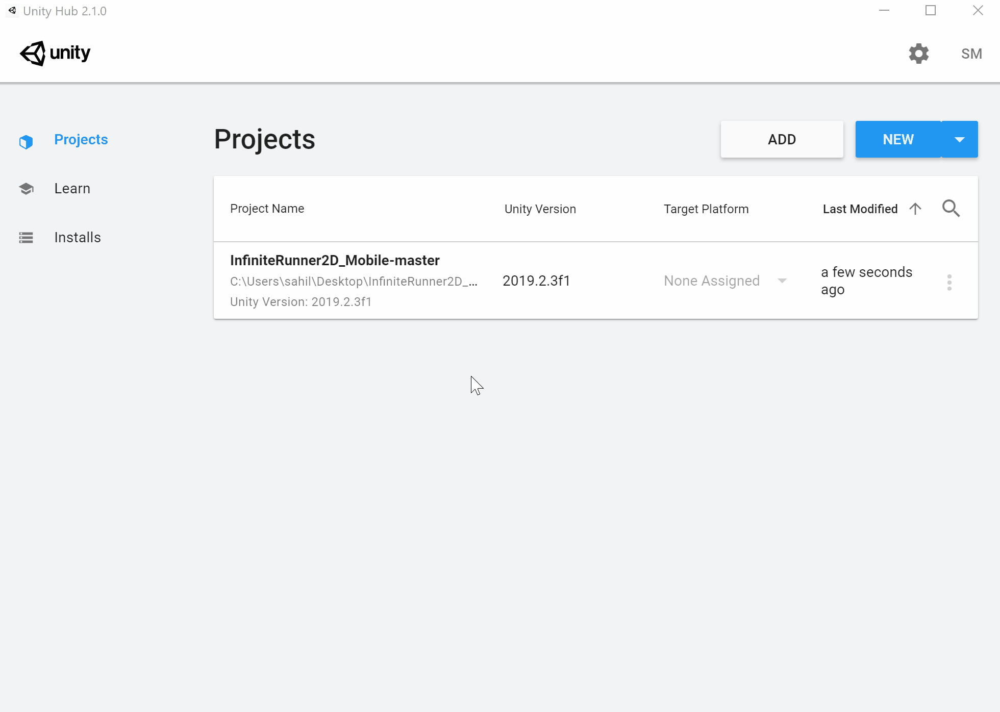

### Setting Up the Cube

By now you should see the Unity editor open, along with a sample scene that was automatically added to your project. There doesn't seem to be much going on here, so let's add a cube to it.

On the menu bar, go to `GameObject` -> `3D` -> `Cube`. A cube will now appear in the center of the scene. Let's make it do something, perhaps spin as the name of this section suggests. In the inspector, click on the _**Add Component**_ button and add a new script with the name "CubeBehaviour". You will now see that the C# file appears in our Assets folder. Double click it to launch your favorite code editor.

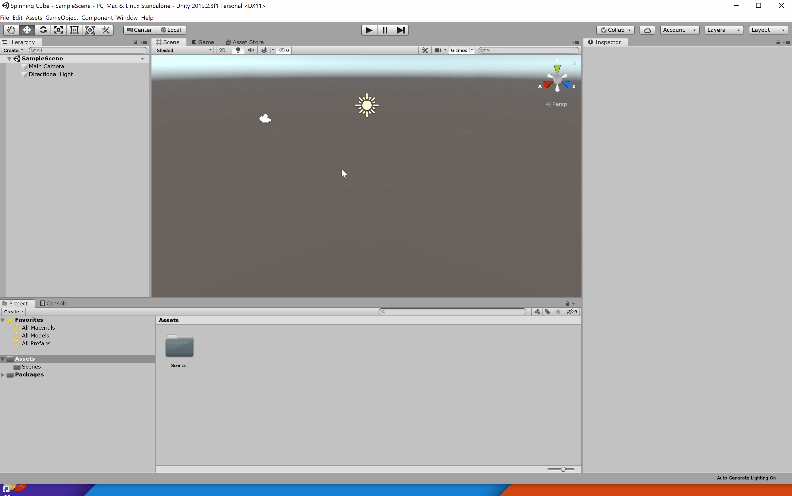

You will see that two functions were automatically generated for you in the script: _**Start**_ and _**Update**_. _**Start**_ is called before the first frame whereas _**Update**_ is called every frame. 

The following line of code will print "Hello world!" into the Unity Editor's console at the start of your program. The Debug class contains many static methods to log errors, exceptions, warnings, and messages to the console. These can be especially helpful when you're running your program and are trying to figure out what is happening behind the scenes in order to debug unexpected behavior. Go ahead and copy this code into your _**Start**_ function.

```c#
Debug.Log("Hello world!");
```

The following line of code will rotate the cube steadily with each passing frame. Copy it into your _**Update**_ function.

```c#
transform.Rotate(Vector3.up, 100 * Time.deltaTime);
```

Make sure to save your script once you've edited it.

**Note:** Much of what we've described in this section may be confusing and unfamiliar to you, but don't worry! We'll go over the Unity terminology, organization, and life cycle in more detail during our next class session.

### Testing the Project

We've done a lot since we first created this project. Let's make sure to save our scene (`Ctrl+S` (Windows) / `⌘Cmd+S` (Mac) or `File` -> `Save`). You'll know it has saved once the asterick by the scene name disappears.

Next click the play button to see your work in action.

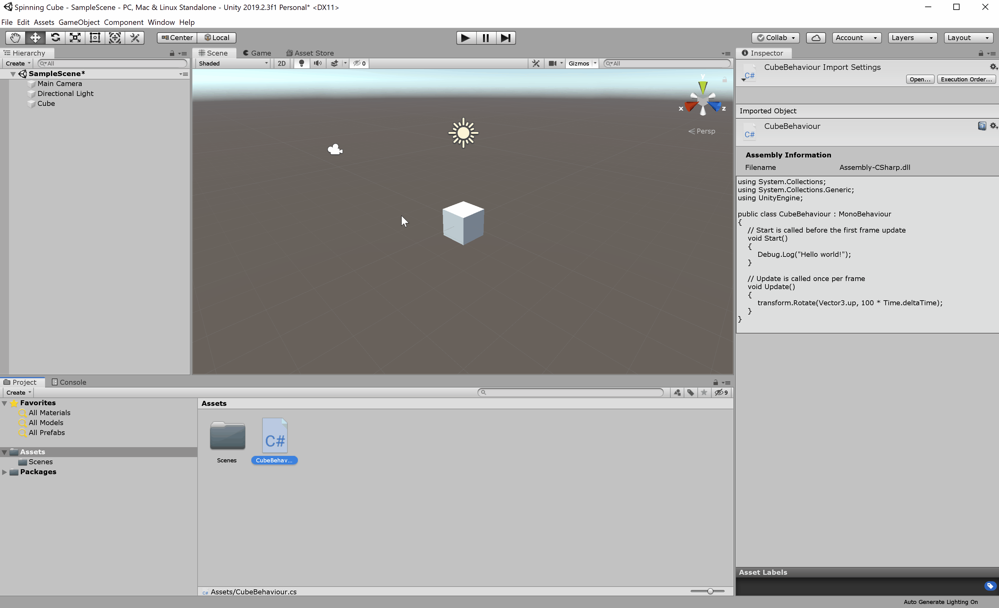

### Bonus Tasks (Optional)

* See if you can change the color of the cube. _(Hint: Look into materials)_
* See if you can change the color of the cube over time. _(Hint: Use a script)_
* Be creative. Experiment. Test things out.

### Setting the Settings

Now that we know the project works in the editor, let's go ahead and set it up to be built. First we have to add our scene to the build. To do this, open up the _**Build Settings**_ window and click on the _**Add Open Scenes**_ button. Next, switch the target platform to _**Android**_. Finally, we have to change a few _**Player Settings**_. Note that most _**Player Settings**_ are platform-specific (i.e. you have a different set of player settings for Android, iOS, etc.).

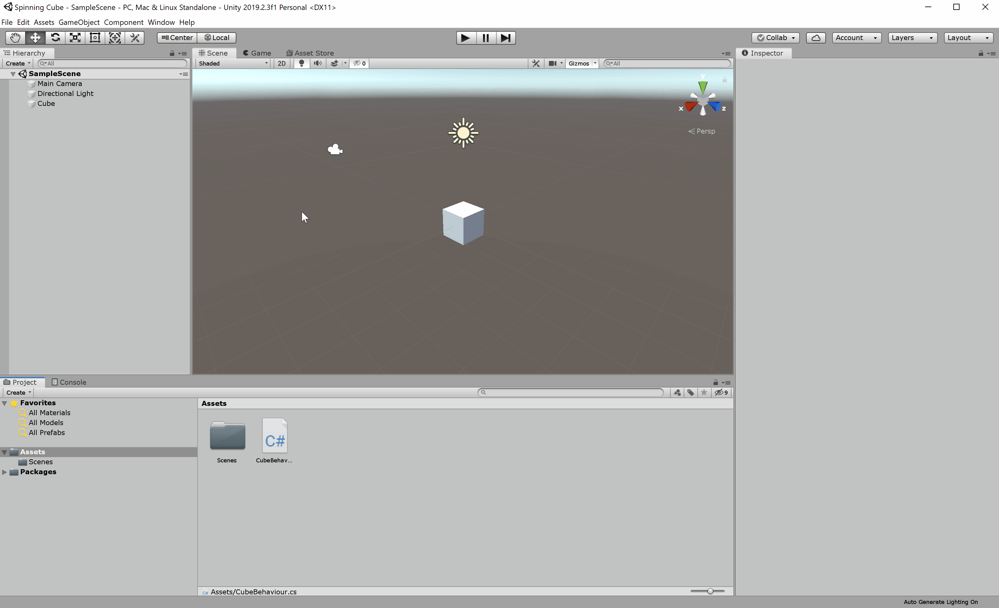

The _**Product Name**_ is the name of the app that you will see when it is installed to your phone. Go ahead and set this to `Last_First_SpinningCube`.

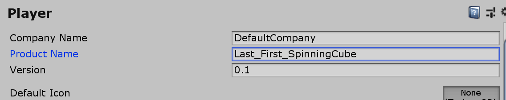

The _**Package Name**_ is your app's unique identifier on your phone and the Play Store. Set this to `com.Last.First.SpinningCube`.

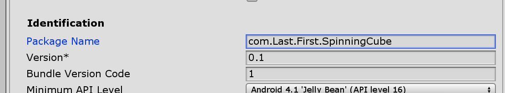

On Android, Unity gives you the option to use either the _**Mono**_ or the _**Il2CPP**_ scripting backend. For this class, we will always use the IL2CPP option. It is supported by a greater variety of target platforms, and more importantly is the only scripting backend option available for the iOS platform. Thus, using this should hopefully ensure greatest consistency in app behavior regardless of if you build/test with iOS or Android.

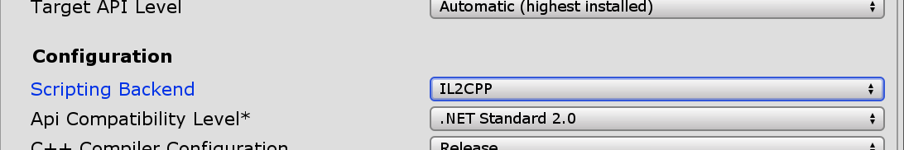

Once you have finished setting these settings, build and run your program on yoru phone following the same process as the last section. Remember to create a "Build" or "Builds" folder and to save the .apk file as `LastName_FirstName_SpinningCube.apk`.

### Debugging from the Phone

So far we've been able to test projects from the Editor and receive debug messages, and we've also been able to successfully deploy and run projects on our phones but without seeing the Debug messages. But what if you're in a situation where everything seems to work fine in the editor but not on your phone. Or what if you're dealing with an app that is just hard to test in the editor, for example an AR app that needs to access the phone's camera and underlying AR platform or a VR app that uses motion controllers? Luckily, you can still receive debug messages in the Unity Editor console from a development build of the app running on your phone. Let's test this out.

In the _**Build Settings**_ window, select the following options: _**Development Build**_, _**Script Debugging**_, and _**Wait for Managed Debugger**_.

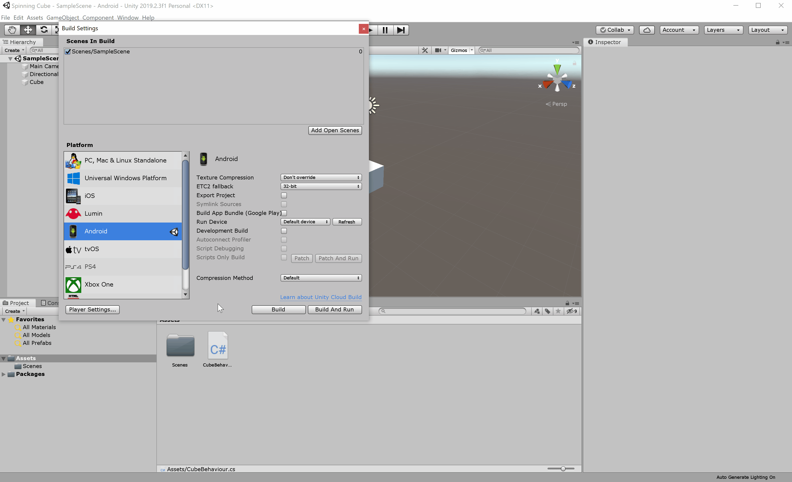

Now you can build and deploy your app as you normally would. Since you are switching between a non-development and development build, it is a good idea to uninstall the app from your phone before proceeding. Make sure to name this apk `LastName_FirstName_SpinningCube_Debug.apk`.

Once the app launches on your phone, you will arrive at the following screen.

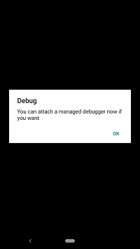

At this point, you should set the Unity Editor console to show output from the Android device. Once you have done this, click the _**OK**_ button on your phone. Once your scene loads, you will see your "Hello world!" message appear in the console.

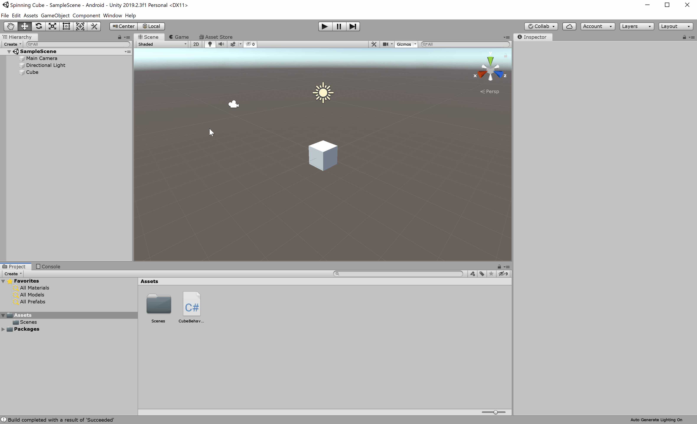

### Adding the Git Client

Use your system file explorer to navigate to your project directory. You will see that Unity and Visual Studio have automatically generated many files, and perhaps even more in sub-folders. In big projects, this number can even run in the thousands, thereby increasing the project size and making it harder to share! Luckily, not all of these files are actually necessary for sharing your project, and you can easily manage this using Git.

We will use the GitHub for Unity asset, which can be downloaded for free from the Asset Store. The Asset Store is a marketplace for downloading and purchasing assets to use in your project, from UIs to 3D models to plugins to SDKs. Note that in general, use of the Asset Store is not permitted in homework projects unless otherwise specified in the project instructions.

Note that using the GitHub for Unity plugin does not necessarily mean that your project is actually being hosted in GitHub. Rather, it will serve as a Git client locally on your machine with a GUI that you can use directly in the Unity editor. It will not point to a remote branch unless you explicitly specify one.

Go to the _**Asset Store**_ tab, search for the GitHub for Unity asset, and import it into your project.

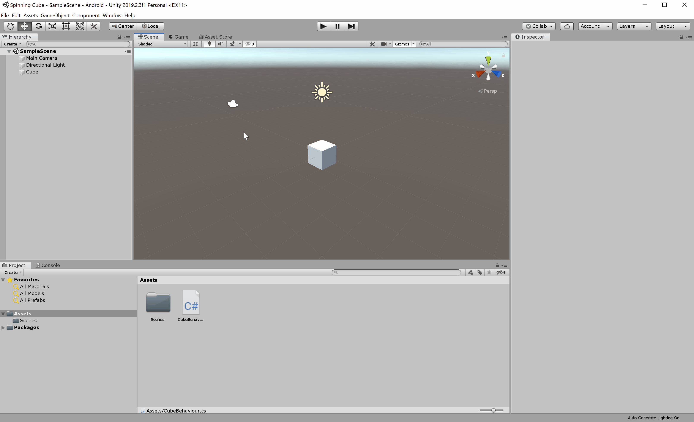

Once the plugin has initialized, go to `Window` -> `GitHub`, initialize the repo, and then add and commit all the files. You will know that the commit was successful once the assets no longer have a green plus mark on them.

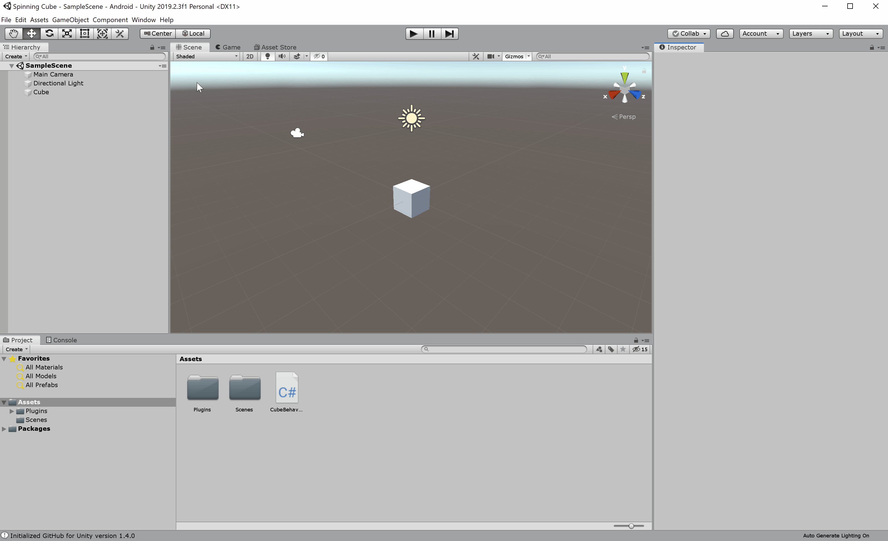

### Zipping your Project

Finally, exit out of Unity, open up a terminal, navigate to your project folder, and enter the command below. This will create a zip file containing only the necessary files for the project, following the rules outlined in the `.gitignore` file. Note that this command only considers files and assets that were included in the latest commit.

```shell
git archive -o Last_First_SpinningCube.zip HEAD
```

## Submission Details

Your submission to ELMS should consist of the following 4 files:

* Last_First_InfiniteRunner.apk
* Last_First_SpinningCube.zip
* Last_First_SpinningCube.apk
* Last_First_SpinningCube_Debug.apk