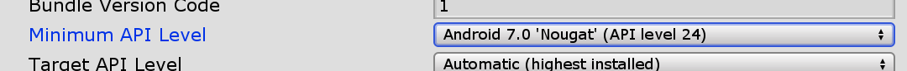
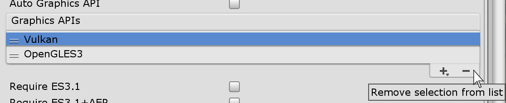
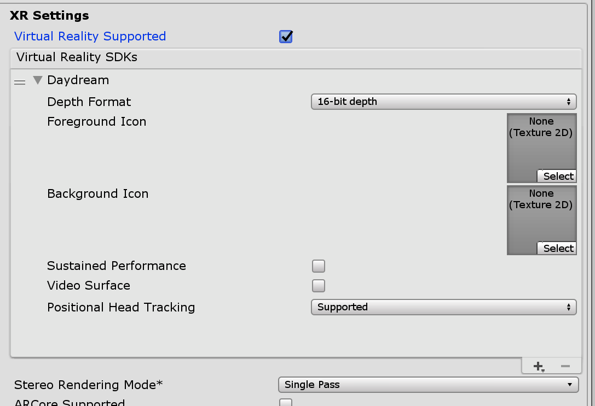

# Project 3: Barrel Bouncer VR Edition

**Due:** Friday, October 25, 2019 at 4:59:59 AM EDT

In this project, you will expanding upon your [Project 2](https://github.com/cmsc388M/fall19/tree/master/project2) submission and transforming it into a VR experience, where you can pick up and throw the balls with a controller and also be transported inside of a barrel. This project is intended to give you hands-on practice with some of the VR user experience guidelines and performance optimization techniques that you were introduced to in the readings and in class.

## A Note About VR SDKs

When deciding which tools to use to build your VR application in Unity, two particular options emerge: vendor-specific SDKs and the Unity XR APIs. Unity's APIs enable cross-platform VR development, allowing for headset tracking and controller input regardless of which supported VR platform you are targeting (i.e. you can have a single codebase that supports Oculus, Gear VR, Google Daydream, Windows Mixed Reality, etc.). However, they are very barebones outside of these basic functionalities and using it may require you to implement a lot of other setup/interactivity yourself from scratch. On the other hand, vendor-specific SDKs typically only support the vendor's hardware but are more comprehensive. They allow you to take full advantage of the device's capabilties and often include built-in prefabs and components that take care of a lot of the common UX interactions. This allows for more rapid development and more consistent experiences within a particular ecosystem. They also typically have good documentation. For this reason, we have decided to have you use the Google VR SDK to implement the features in this project, in particular focusing on targeting Google Daydream headsets. However, many of the concepts between VR headsets are similar, so if you own another VR headset that you would like to target instead, feel free to use its vendor's SDK or the Unity APIs. Note that this option may be more difficult as we may not be able to help you as much if you get stuck. If you plan to use this option, you should let us know soon.

## Instructions

At a high level, these are the main tasks that this project involves. Read below for more detailed information about each.

- Change the build and player settings of your project to support Android and the Google Daydream platfrom.
- Replace your character controller and input mechanisms with appropriate prefabs in the Google VR SDK.
- Modify your 3D environment to better suit the new functionality and optimize it for performance.
- Implement teleportation functionality for easy movement around your scene.
- Add controller-based interactivity to the balls so they can be picked up and thrown.
- Insert spatial audio effects to provide feedback when the ball hits a barrel.
- Build world-space user interfaces to provide user with helpful cues and to have a "main menu" for the app.
- Create a basic 360° photo scene to place you "inside" of a barrel and design a way to switch between the two scenes.
- Build and deploy your apk file to a supported Android device and test your app in a Daydream headset.
- Use Git to create a zip file of the your project and submit it via ELMS.

### Make a Backup (Optional)

We strongly recommend that you make a back up of your project 2 before proceeding. If you _correctly_ generated your zip file for your last submission, that should suffice as a backup.

### Build and Player Settings

The first steps are to add your scene to the build, switch your build platform to _**Android**_, and set the player settings as follows:

- **Product Name:** Last_First_BarrelBouncer_VR
- **Package Name:** com.Last.First.BarrelBouncer.VR
- **Scripting Backend:** IL2CPP

Note that these are some of the same steps from project 0, so make sure to check it out [here](https://github.com/cmsc388M/fall19/tree/master/project0#setting-the-settings) if you need a refresher.

However, there are some additional player settings that we will need to change to make your project ready for the Daydream VR platform. First, you will have to change the minimum Android API level to 24 or higher. This is because the Daydream platform was only introduced with Android 7.0 Nougat, and is thus only supported from that point onwards. This setting is under the _**Identification**_ section of _**Other Settings**_.



The next thing that you will have to do is remove the Vulkan from the list of Graphics APIs that your app supports. Vulkan is a relatively new cross-platform 3D graphics API with low-overhead and high-performance, and was previously referred to as a "next generation OpenGL initiative". It is included as the default graphics option for the Android platform in Unity but is not currently supported by Unity for XR applications. To remove this, go to the graphics API list under the _**Rendering**_ settings of _**Other Settings**_, click on _**Vulkan**_, and then click on the minus sign.



Now we will deal directly with the VR specific settings. Go down to the _**XR Settings**_ section of the _**Player Settings**_ and click on the _**Virtual Reality Supported**_ checkbox. Then, under the _**Virtual Reality SDKs**_ list, add support for the _**Daydream**_ platform. Finally, on the _**Stereo Rendering Mode**_ dropdown menu, select the _**Single Pass**_ option. Note that Single Pass Stereo rendering was one of the topics we went over during our discussion of optimizing mobile VR performance. For a refresher on why we use this, please see the first half of [this page on the Unity documentation](https://docs.unity3d.com/Manual/SinglePassStereoRendering.html).



By applying these settings, Unity now knows that this is a VR app and will take this into consideration when generating the build. This means that it will use a filter to split the phone screen in half and apply the appropriate distortions when rendering the scene, so that it looks normal again when viewed through the VR lenses, much like we discussed in class. It will also make sure to track the phone's rotation.


### Adding the Google VR SDK

In the previous projects, you were introduced to the concepts of packages and how to import them into your project using the _**Asset Store**_ and the _**Package Manager**_. However, Unity also makes it easy to import and export your own custom packages outside of these distribution channels. Packages are stored with the file extension `.unitypackage`. In this part, you will be downloading the Google VR SDK unitypackage and adding that into your project.

- Using your web browser, navigate to this link: https://github.com/googlevr/gvr-unity-sdk/releases/latest
- Under the "Assets" section, click on the .unitypackage file to download it. It is typically the first item and will be named like `GoogleVRForUnity_1.200.1.unitypackage`.
- In your Unity project, go to `Assets` -> `Import Package` -> `Custom Package` and use your computer's file explorer to select the file that you downloaded.
- In the popup Window that appears, make sure that all of the items are selected (they should be by default) and click on the _**Import**_ button.
- Once this is finished, you will see a _**GoogleVR**_ folder in your project.

### Examples and Resources (Optional)

At this point, you now know how to complete initial setup and configuration settings of a Google Daydream project, however, you are probably still wondering how you can actually make use of the SDK in your project. A lot of this project will guide you through this, but if you're ever lost or want to see some examples or tutorials to get comfortable before moving forward, the following resources may be helpful:

- Google includes its very own example of a Daydream VR scene within the package that you imported. Navigate to `Assets` -> `GoogleVR` -> `Demos` -> `Scenes` and open up the _**HelloVR**_ scene so you can see how the project is structured. This is also a good scene to get practice with using the Editor and Controller emulators that you can later use to test your own scene.
- [This tutorial](https://youtu.be/xz5cP2JdxTM) does a great job at introducing how you can build your own Daydream VR experience from scratch.
- We have also created our own basic example of a Google VR sample project that you can reference as well. It is a completed version of the tutorial from the previous item with a few modifications. You can take a look at it [here](https://github.com/cmsc388M/fall19/tree/master/examples/GoogleVRSample) (in the examples/GoogleVRSample folder of this repo).
- The Google VR Documentation, in particular the [guides](https://developers.google.com/vr/develop) and [API Reference](https://developers.google.com/vr/reference).

### Setting Up Your Scene for Google VR

The first step is to delete your character controller's gameobject as well as any other cameras that may be present in the scene. You will instead be setting up and using a new GameObject for your player in your scene, which is described later in this section.

Next, you will need to add a couple of new GameObjects to your scene that are included as prefabs within the Google VR SDK. Make sure that each of these are at a position of (0, 0, 0) when you add them.

- [GvrEventSystem Prefab](https://developers.google.com/vr/reference/unity/prefab/GvrEventSystem)
  - located in `Assets`-> `GoogleVR` -> `Prefabs` -> `EventSystem`
  - In Unity, the Event System defines how input from a user triggers events on GameObjects (like OnMouseEnter or raycasting from mouse input). Whenever you include UIs in your Unity project, your scene is required to have an _**EventSystem**_ GameObject. This is why you may have noticed it in your Shark Runner project, since we used UIs for the text and the buttons in the starter project we provided.
  - The Google VR EventSystem builds upon Unity's default one by replacing the default input module (which defines input mechanisms) with its own (to allow for custom controller input and mappings).
  - Make sure this is the only EventSystem present in your scene! Since you were not dealing with UIs in your last project, you probably do not already have an EventSystem in your scene, but in case you do, make sure to remove it before adding this prefab. If there are two or more EventSystems in your scene, interactions with UIs may not work.
- [GvrHeadset Prefab](https://developers.google.com/vr/reference/unity/prefab/GvrHeadset)
  - located in `Assets`-> `GoogleVR` -> `Prefabs` -> `Headset`
  - This prefab allows for positional 6DOF tracking on headsets that support it.
- [GvrControllerMain Prefab](https://developers.google.com/vr/reference/unity/prefab/GvrControllerMain)
  - located in `Assets`-> `GoogleVR` -> `Prefabs` -> `Controller`
  - This prefab allows you to access the Controller API and also emulate the movements of the Daydream controller when you test your app in the Editor. You can rotate the controller by holding down shift and moving the mouse while playing the app. You can also simulate button clicks on the controller using the right and left mouse buttons. The full controls for the controller emulator are listed on the GvrController component attached to the prefab.
- [GvrEditorEmulator Prefab](https://developers.google.com/vr/reference/unity/prefab/GvrEditorEmulator)
  - located in `Assets`-> `GoogleVR` -> `Prefabs`
  - This prefab allows you to simulate head movement of the VR headset when testing in your Editor. Once you place this prefab in your scene and hit play you can hold down Alt and move your mouse in order to simulate the rotation of the player's head.
- [GvrInstantPreview Prefab](https://developers.google.com/vr/reference/unity/prefab/GvrInstantPreviewMain) _(OPTIONAL)_
  - located in `Assets`-> `GoogleVR` -> `InstantPreview`
  - Unfortunately, Google has deprecated the use of in-Editor simulation to test your apps in favor of their _**Instant Preview**_ feature, which allows you to stream the app from the Editor to your phone via the local WiFi network. This allows you to test your app in an actual headset without having to generate a build, however, it requires you to actually own a compatible phone and headset.
  - Just because the simulation of the head movements and controller via the Editor are marked as deprecated, this does not mean that they do not work. In fact, they continue to work quite well. For this reason, we will expect you to test your app using the in-Editor simulations until you are able to come in to test it on an actual headset. However, if you do own Daydream headset and a compatible phone and would like to use the Instant Preview method for your testing, you are welcome to do so. Please refer to the linked documentation for further details and steps.

Next, we will be creating our _**Player**_ GameObject. This will be the parent object for your camera and your controller model, allowing them to move together. Note that this is a similar setup to Google's HelloVR example scene.

- Create an empty GameObject and name it "Player". Set its position to (0, 1.6, 0).
- In the heirarchy, right-click on your Player GameObject and add a Camera as a child GameObject. Make sure the Camera's local coordinates are set to (0, 0, 0) and set its tag to "MainCamera".
- Go to `Assets` -> `GoogleVR` -> `Prefabs` -> `Controller` and drag the prefab entitled GvrControllerPointer onto your Player GameObject in your heirarchy. This will create an instance of it as a child object of your player. Make sure to set its local coordinates to (0, 0, 0) as well.
  - This prefab places a 3D model of a Daydream controller into your scene that will sync up to the movements of the actual Daydream motion controller in your final app. It also has a built-in laser pointer and includes an [arm model](https://developers.google.com/vr/elements/arm-model) to estimate the location and positional movements of your controller, despite it being a 3DOF device (i.e. the controller's sensors only track rotation, not positional movement, but uses known measurements about a typical person's arm to calculate where your controller is located relative to your camera/head).
- Finally, add the component _**Gvr Pointer Physics Raycaster**_ to your camera. This script will allow your pointer to raycast onto 3D objects in your scene, allowing you to interact with them.

If you looked at the Google HelloVR example, you may notice that we didn't add the GvrRecticlePointer as a child GameObject of the camera. The GvrRecticlePointer is a pointer that always sits at the center of your view and is mostly used for Google Cardboard applications, since it doesn't have a sophisticated controller. Since we're not targeting this platform, adding in this prefab is not necessary. 

### Modifying Your Environment

In this section, you will be modifying your environment to optimize for performance with occlusion culling and will place barrels around the scene, since you will no longer be spawning them at runtime. You will also import a model of a basket and place balls into them.

### Moving via Teleporation

In the barrel bouncer scene we are going to move via teleportation. When the pointer is touching a static object, like the terrain gameObject in your scene, and they click, they should teleport to that object. If the pointer is clicked on the barrels, balls, or UI elements in the scene the user **should not** teleport to them and should remain in place instead. If you want to get the world location of the pointer you can use the the [PointerEventData](https://docs.unity3d.com/Packages/com.unity.ugui@1.0/api/UnityEngine.EventSystems.PointerEventData.html) class like we did in the example script, or you can get the transform of the pointer via GvrPointerInputModule.Pointer.PointerTransform. It is up to you how you want to implement this method, just make sure that teleportation is only possible on non moving static gameObjects and that you cant teleport onto UI or into the air.

### Making Balls Interactable

For this VR version of barrel bouncer we will not be instantiating balls on demand, instead we will make a new ball prefab that can be picked up via the pointer and thrown. When the pointer is hovering over a ball and the click button is pressed and held down, the ball should snap in front of the controller and remain there until the click is released. An easy way to make the ball remain in front of the controller would be to parent the ball to the controller while the click button is still pressed down.  When the click button is released the ball should fly forward in the direction the controller was pointing and destroy any barrel it comes into contact with similar to the first project. Once you have made a gameObject that does this, make it into a prefab and place a couple of them into the scene.

### Spatial Audio Feedback

Now you should add spatial audio to the balls whenever they collide with a GameObject. In order to play spatial audio a GameObject needs to have an audio clip component attached to it with the Spatialize bool ticked on:

Whenever the ball hits an object the audio should play the BounceSound audioclip (found in the SampleScripts/Sounds folder) at the given location. The clip should not loop and should play to completion even if the ball is destroyed as a result of that collision.

### Creating the Navigational Menu

We are now going to make a World Space Menu that the user can activate and deactivate by pressing the app button. **The menu should always appear in front of the user when it is brought up, even after the user teleports.** To make the menu first make a world space canvas with 2 Buttons:

- Restart Level - The text attached to the button should be changed to "Restart Level", and when the button is clicked it should restart the current scene.
- Main Menu - The text should read "Return to Main Menu" and should move the player to the intro scene.

Once you have created the menu, the user should be able to open and close the menu using by pressing the app button on the DayDream controller, similar to the pause menu functionality in Shark Runner. In order to poll the input for the Daydream controller you will have to use a special input function from the GvrControllerInputDevice class. To do this first get a reference to the current controller instance with this code
```
GvrControllerInputDevice controller  = GvrControllerInput.GetDevice(GvrControllerHand.Dominant)
```
and then poll that controller for the App Button input like so:
```
if (controller.GetButtonDown(GvrControllerButton.App)){
//Do stuff here
}
```

### Add Main Menu Scene

As our final step, will add a second scene to our Barrel Bouncer project that will display a 360 photo and will serve as the introductory scene. Make a new scene called "IntroScene" and add all of the neccessary GoogleVR prefabs listed above. Then place a sphere object in the scene, remove its collision, and scale it up so that it surrounds the player. Then add the "FlipMesh" component to the sphere which will invert the sphere and allow us to show a texture on the inside by applying the "SphereMat" material to the sphere. Finally, create a world space UI button with text that reads "Play" and have the button change to the barrel bouncer main scene when it is pressed.

## Submission Details

Your submission to ELMS should consist of the following 2 files:

- `Last_First_BarrelBouncer_VR.zip`
- `Last_First_BarrelBouncer_VR.apk`

**Make sure to use Git to zip your project**. The basic steps involve initializing a new repo, adding and committing all your changes, and using archive to create the zip file. Additionally, make sure that the apk file you submit is not a development/debug build. If you need a refresher on how to generate either of these two files, please refer to the [Project 0 Instructions](https://github.com/cmsc388M/fall19/tree/master/project0).
