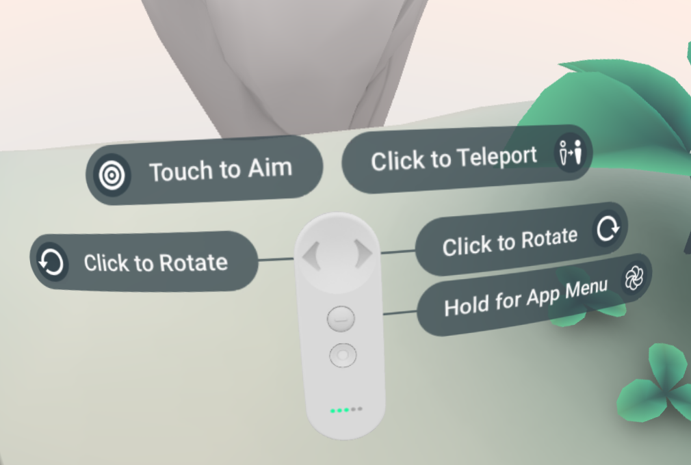

# Project 3: Barrel Bouncer VR Edition

**Due:** Friday, October 25, 2019 at 4:59:59 AM EDT

In this project, you will expanding upon your [Project 2](https://github.com/cmsc388M/fall19/tree/master/project2) submission and transforming it into a VR experience, where you can pick up and throw the balls with a controller and hear spatial audio feedback of the interactions around you. This project is intended to give you hands-on practice with some of the VR user experience guidelines and performance optimization techniques that you were introduced to in the readings and in class.

## A Note About VR SDKs

When deciding which tools to use to build your VR application in Unity, two particular options emerge: vendor-specific SDKs and the Unity XR APIs. Unity's APIs enable cross-platform VR development, allowing for headset tracking and controller input regardless of which supported VR platform you are targeting (i.e. you can have a single codebase that supports Oculus, Gear VR, Google Daydream, Windows Mixed Reality, etc.). However, they are very barebones outside of these basic functionalities and using it may require you to implement a lot of other setup/interactivity yourself from scratch. On the other hand, vendor-specific SDKs typically only support the vendor's hardware but are more comprehensive. They allow you to take full advantage of the device's capabilties and often include built-in prefabs and components that take care of a lot of the common UX interactions. This allows for more rapid development and more consistent experiences within a particular ecosystem. They also typically have good documentation. For this reason, we have decided to have you use the Google VR SDK to implement the features in this project, in particular focusing on targeting Google Daydream headsets. However, many of the concepts between VR headsets are similar, so if you own another VR headset that you would like to target instead, feel free to use its vendor's SDK or the Unity APIs. Note that this option may be more difficult as we may not be able to help you as much if you get stuck. If you plan to use this option, you should let us know soon.

## About the Google Daydream Hardware

There are two headsets available for the Google Daydream platform: the Google Daydream View and the Lenovo Mirage Solo with Daydream. The former is a 3DOF headset for smartphones, similar to the Samsung Gear VR. A list of compatible phones can be found [here](https://vr.google.com/daydream/smartphonevr/phones/). The latter is a 6DOF standalone VR headset, similar to the Oculus Quest. In either case, the experiences are mostly stationary or within a small confined space.

Both headsets come with a single 3DOF controller. We recommend you familiarize yourself with its layout, buttons, intended functionality, and capabilities before moving further. See the [support page](https://support.google.com/daydream/answer/7184597) and [developer page](https://developers.google.com/vr/discover/controllers) for more info.

Note that while the controller itself is 3DOF, you can achieve 6DoF style controller interactions using an arm model, which we will discuss later.

## Instructions

At a high level, these are the main tasks that this project involves. Read below for more detailed information about each.

- Change the build and player settings of your project to support Android and the Google Daydream platfrom.
- Replace your character controller and input mechanisms with appropriate prefabs in the Google VR SDK.
- Modify your 3D environment to better suit the new functionality and optimize it for performance.
- Implement teleportation functionality for easy movement around your scene.
- Add controller-based interactivity to the balls so they can be picked up and thrown.
- Insert spatial audio effects to provide feedback based on ball interactions.
- Create a navigational app menu to allow user to reset level or go back to intro scene (next bullet).
- Build a new "intro scene" to the app using 360° photo, music, and a world-space user interface.
- Handle scene management for switching between the scenes.
- Build and deploy your apk file to a supported Android device and test your app in a Daydream headset.
- Use Git to create a zip file of the your project and submit it via ELMS.

### Make a Backup (Optional)

We strongly recommend that you make a back up of your project 2 before proceeding. If you _correctly_ generated your zip file for your last submission, that should suffice as a backup.

### Build and Player Settings

The first steps are to add your scene to the build, switch your build platform to _**Android**_, and set the player settings as follows:

- **Product Name:** Last_First_BarrelBouncer_VR
- **Package Name:** com.Last.First.BarrelBouncer.VR
- **Scripting Backend:** IL2CPP

Note that these are some of the same steps from project 0, so make sure to check it out [here](https://github.com/cmsc388M/fall19/tree/master/project0#setting-the-settings) if you need a refresher.

However, there are some additional player settings that we will need to change to make your project ready for the Daydream VR platform. First, you will have to change the minimum Android API level to 24 or higher. This is because the Daydream platform was only introduced with Android 7.0 Nougat, and is thus only supported from that point onwards. This setting is under the _**Identification**_ section of _**Other Settings**_.


The next thing that you will have to do is remove the Vulkan from the list of Graphics APIs that your app supports. Vulkan is a relatively new cross-platform 3D graphics API with low-overhead and high-performance, and was previously referred to as a "next generation OpenGL initiative". It is included as the default graphics option for the Android platform in Unity but is not currently supported by Unity for XR applications. To remove this, go to the graphics API list under the _**Rendering**_ section of _**Other Settings**_, click on _**Vulkan**_, and then click on the minus sign.


Since you're already in the _**Rendering**_ section, make sure to enable Static and Dynamic batching, if they aren't already. These are some of the topics we discussed in our discussion of optimizing mobile VR performance. For a refresher on why we use them, please see [this page on the Unity documentation](https://docs.unity3d.com/Manual/DrawCallBatching.html).


Now we will deal directly with the VR specific settings. Go down to the _**XR Settings**_ section of the _**Player Settings**_ and click on the _**Virtual Reality Supported**_ checkbox. Then, under the _**Virtual Reality SDKs**_ list, add support for the _**Daydream**_ platform. Finally, on the _**Stereo Rendering Mode**_ dropdown menu, select the _**Single Pass**_ option. Note that Single Pass Stereo rendering was also one of the topics we went over during our discussion of optimizing mobile VR performance. For a refresher on why we use this, please see the first half of [this page on the Unity documentation](https://docs.unity3d.com/Manual/SinglePassStereoRendering.html).


By applying these settings, Unity now knows that this is a VR app and will take this into consideration when generating the build. This means that it will use a filter to split the phone screen in half and apply the appropriate distortions when rendering the scene, so that it looks normal again when viewed through the VR lenses, much like we discussed in class. It will also make sure to track the phone's rotation.


### Adding the Google VR SDK

In the previous projects, you were introduced to the concepts of packages and how to import them into your project using the _**Asset Store**_ and the _**Package Manager**_. However, Unity also makes it easy to import and export your own custom packages outside of these distribution channels. Packages are stored with the file extension `.unitypackage`. In this part, you will be downloading the Google VR SDK unitypackage and adding that into your project.

- Using your web browser, navigate to this link: https://github.com/googlevr/gvr-unity-sdk/releases/latest
- Under the "Assets" section, click on the .unitypackage file to download it. It is typically the first item and will be named something like `GoogleVRForUnity_1.200.1.unitypackage`.
- In your Unity project, go to `Assets` -> `Import Package` -> `Custom Package` and use your computer's file explorer to select the file that you downloaded.
- In the popup Window that appears, make sure that all of the items are selected (they should be by default) and click on the _**Import**_ button.
- Once this is finished, you will see a _**GoogleVR**_ folder in your project.

### Basic Examples and Resources

At this point, you now know how to complete initial setup and configuration settings of a Google Daydream project, however, you are probably still wondering how you can actually make use of the SDK in your project. This might be a good time to check out the following examples to get a basic understanding of how Google VR scenes are structured:

- Google includes its very own example of a Daydream VR scene within the package that you imported. Navigate to `Assets` -> `GoogleVR` -> `Demos` -> `Scenes` and open up the _**HelloVR**_ scene so you can see how the project is structured. This is also a good scene to get practice with using the Editor and Controller emulators that you can later use to test your own scene.
- [This tutorial](https://youtu.be/xz5cP2JdxTM) does a great job at introducing how you can build your own Daydream VR experience from scratch.
- We have also created our own basic example of a Google VR sample project that you can reference as well. It is a completed version of the tutorial from the previous item with a few modifications. You can take a look at it [here](https://github.com/cmsc388M/fall19/tree/master/examples/GoogleVRSample) (in the examples/GoogleVRSample folder of this repo).

Another great resource you can refer to as you develop your project is the Google VR Documentation, in particular the [guides](https://developers.google.com/vr/develop) and [API Reference](https://developers.google.com/vr/reference).

### Google Daydream Elements (Advanced But Important Samples)

Once you are comfortable with the above examples, you should move on to exploring Daydream Elements. As we mentioned earlier, one reason for using vendor-specific SDKs is that they often have built-in prefabs and components that make it easy to implement UX best practices for the platform. Google has separated these out of their core VR SDK into something they call Daydream Elements, which they describe as follows:

- _Daydream Elements is a collection of Unity tech demos that showcase principles and best practices for developing high-quality VR experiences. The core mechanics in each demo are built to be easily configurable and reusable for your own applications._

You can learn more about Daydream Elements from [this video](https://youtu.be/WxX_Q7VA8No), [this blog post](https://www.blog.google/products/daydream/daydream-elements-foundational-vr-design/) (from the assigned readings), and [the documentation](https://developers.google.com/vr/elements/overview).

Google has released a `.unitypackage` file where you can add Daydream Elements directly into your own app, much like you did before with the Google VR SDK. However, it is not recommended to do this. Google has not updated the project since November 2017 and has since archived the project. This means that it uses an old version of the SDK, and thus has a ton of conflicts and errors that come up when you try to use it with the latest SDK.

Luckily, you can still see how the Daydream Elements examples work using the old SDK, since they have the full Unity project with the old SDK up on GitHub. Additionally, many of the important assets aren't really affected by the conflicts and are still usable with the new SDK. As we mentioned before, Unity makes it easy to import AND export assets for use between projects, and we feel that exporting them from the Daydream Elements project is the best way to go. We'll explore this more in the [teleportation section](#moving-via-teleporation). For now, just focus on trying out and understanding the scenes in this project:

- Download or clone the Daydream Elements project from the [GitHub page](https://github.com/googlevr/daydream-elements) and open up the project using the Unity Hub.
- Open up the main scene (located in `Assets` -> `DaydreamElements` -> `Main` -> `Scenes`) and click the play button. This will bring up a menu to transport you to a bunch of different scenes that each showcase a particular UX interaction.
- Once you are done, open up any scenes you found interesting to see how they worked. Two that may be particularly useful for this project are the _**Teleport**_ and the _**ArmModels**_ scenes. 

Simulating this in the Editor is one thing, but actually trying it out on a headset is even more beneficial to helping you understand how these UX mechanisms fit in to the big picture. Google has published the Daydream Elements VR app on the Google Play Store for Android, and we are happy to let you try it out if you come in during office hours.

### Setting Up Your Scene for Google VR

The first step is to delete your character controller's gameobject as well as any other cameras that may be present in the scene. You will instead be setting up and using a new GameObject for your player in your scene, which is described later in this section.

Next, you will need to add a couple of new GameObjects to your scene that are included as prefabs within the Google VR SDK. Make sure that each of these are at a position of (0, 0, 0) when you add them.

- [GvrEventSystem Prefab](https://developers.google.com/vr/reference/unity/prefab/GvrEventSystem)
  - located in `Assets`-> `GoogleVR` -> `Prefabs` -> `EventSystem`
  - In Unity, the Event System defines how input from a user triggers events on GameObjects (like OnMouseEnter or raycasting from mouse input). Whenever you include UIs in your Unity project, your scene is required to have an _**EventSystem**_ GameObject. This is why you may have noticed it in your Shark Runner project, since we used UIs for the text and the buttons in the starter project we provided.
  - The Google VR EventSystem builds upon Unity's default one by replacing the default input module (which defines input mechanisms) with its own (to allow for custom controller input and mappings).
  - Make sure this is the only EventSystem present in your scene! Since you were not dealing with UIs in your last project, you probably do not already have an EventSystem in your scene, but in case you do, make sure to remove it before adding this prefab. If there are two or more EventSystems in your scene, interactions with UIs may not work.
- [GvrHeadset Prefab](https://developers.google.com/vr/reference/unity/prefab/GvrHeadset)
  - located in `Assets`-> `GoogleVR` -> `Prefabs` -> `Headset`
  - This prefab allows for positional 6DOF tracking on headsets that support it.
- [GvrControllerMain Prefab](https://developers.google.com/vr/reference/unity/prefab/GvrControllerMain)
  - located in `Assets`-> `GoogleVR` -> `Prefabs` -> `Controller`
  - This prefab allows you to access the Controller API and also emulate the movements of the Daydream controller when you test your app in the Editor. You can rotate the controller by holding down shift and moving the mouse while playing the app. You can also simulate button clicks on the controller using the right and left mouse buttons. The full controls for the controller emulator are listed on the GvrController component attached to the prefab.
- [GvrEditorEmulator Prefab](https://developers.google.com/vr/reference/unity/prefab/GvrEditorEmulator)
  - located in `Assets`-> `GoogleVR` -> `Prefabs`
  - This prefab allows you to simulate head movement of the VR headset when testing in your Editor. Once you place this prefab in your scene and hit play you can hold down Alt and move your mouse in order to simulate the rotation of the player's head.
- [GvrInstantPreview Prefab](https://developers.google.com/vr/reference/unity/prefab/GvrInstantPreviewMain) _(OPTIONAL)_
  - located in `Assets`-> `GoogleVR` -> `InstantPreview`
  - Unfortunately, Google has deprecated the use of in-Editor simulation to test your apps in favor of their _**Instant Preview**_ feature, which allows you to stream the app from the Editor to your phone via the local WiFi network. This allows you to test your app in an actual headset without having to generate a build, however, it requires you to actually own a compatible phone and headset.
  - Just because the simulation of the head movements and controller via the Editor are marked as deprecated, this does not mean that they do not work. In fact, they continue to work quite well. For this reason, we will expect you to test your app using the in-Editor simulations until you are able to come in to test it on an actual headset. However, if you do own Daydream headset and a compatible phone and would like to use the Instant Preview method for your testing, you are welcome to do so. Please refer to the linked documentation for further details and steps.

Next, we will be creating our _**Player**_ GameObject. This will be the parent object for your camera and your controller model, allowing them to move together. Note that this is a similar setup to Google's HelloVR example scene.

- Create an empty GameObject and name it "Player". Set its position to (0, 1.6, 0).
- In the heirarchy, right-click on your Player GameObject and add a Camera as a child GameObject. Make sure the Camera's local coordinates are set to (0, 0, 0) and set its tag to "MainCamera".
- Go to `Assets` -> `GoogleVR` -> `Prefabs` -> `Controller` and drag the prefab entitled GvrControllerPointer onto your Player GameObject in your heirarchy. This will create an instance of it as a child object of your player. Make sure to set its local coordinates to (0, 0, 0) as well.
  - This prefab places a 3D model of a Daydream controller into your scene that will sync up to the movements of the actual Daydream motion controller in your final app. It also has a built-in laser pointer and includes an [arm model](https://developers.google.com/vr/elements/arm-model) to estimate the location and positional movements of your controller, despite it being a 3DOF device (i.e. the controller's sensors only track rotation, not positional movement, but uses known measurements about a typical person's arm to calculate where your controller is located relative to your camera/head).
- Finally, add the component _**Gvr Pointer Physics Raycaster**_ to your camera. This script will allow your pointer to raycast onto 3D objects in your scene, allowing you to interact with them.

If you looked at the Google HelloVR example, you may notice that we didn't add the GvrRecticlePointer as a child GameObject of the camera. The GvrRecticlePointer is a pointer that always sits at the center of your view and is mostly used for Google Cardboard applications, since it doesn't have a sophisticated controller. Since we're not targeting this platform, adding in this prefab is not necessary. 

### Modifying Your Environment

In this section, you will be modifying your environment to better fit our new scenario and to optimize it for mobile VR performance.

#### Beefing Up or Swapping Your Terrain

This project will not directly grade you on your ability to create a terrain. However, you will have to implement and test occlusion culling on your environment, as described [here](#occlusion-culling). This means that if your environment is not complex enough to _easily_ test and verify that occlusion culling is working (i.e. if you only created a few mountains and hills), you will have to edit your terrain to make it more suitable for this task.

Alternatively, if you did not like using the Terrain editor, felt it had too much of a performance impact on your workflow, or would just prefer a different kind of environment in general (like a bustling city or a wild west desert), feel free to delete your terrain and replace it with a different environment. The _**Asset Store**_ has plenty of [free 3D environments](https://assetstore.unity.com/3d/environments?category=3d%2Fenvironments&free=true&orderBy=1) that are ready to use. Low poly environments typically perform well in mobile VR. Like before, the most important thing is to make sure there is enough going on in the scene to easily test occlusion culling.

#### Adding Barrels Into Scene

In this version of the project, you will not be spawning barrels via Raycasting. Rather, they will already be pre-placed within your environment.

Go ahead and place 10+ barrels into your scene. Make sure to have them in a variety of distances and directions from the player's initial starting position.

#### A Bucket for Balls

Go to the _**Asset Store**_ and import a bucket or trash bin to your project. Place it somewhere in your scene near your player's starting position, and then place five instances of your ball prefab inside of it. Your ball prefabs should be roughly the size of a tennis ball. Feel free to resize any of these items as necessary.

#### Occlusion Culling

Next, we will set up your scene to take advantage of occlusion culling, another one of the topics we went over during our discussion of optimizing mobile VR performance. The [Unity documentation](https://docs.unity3d.com/Manual/OcclusionCulling.html) does a great job at taking you through the steps to achieve and test this.

Make sure to set any non-movable elements of your environment (i.e. not the balls or barrels) to static before baking your scene. Additionally, you should set them to fully static as opposed to just the _**Occluder Static**_ and _**Occludee Static**_ that is mentioned in the docs. This will allow it to take advantage of batching and the lighting optimizations in the next section as well.

The _**2 by 3**_ Editor layout is particularly useful when testing your scene for occlusion culling. The GIFs below show how an example terrain is being rendered with frustrum culling (enabled in Unity by default) vs. with occlusion culling.

| Frustrum Culling (Default) | Occlusion Culling |
| ------------- | ------------- |
|  |  |

#### Lighting Optimization

Realtime global lighting during runtime can allow you to achieve very realistic results, but it comes at a significant cost to the performance. Hence, it is recommended to disable this in mobile VR and just used baked lighting instead.

- In the menu bar, go to `Window` -> `Rendering` -> `Lighting Settings`.
- Unselect the _**Realtime Global Illumination**_ checkbox from the _**Realtime Lighting**_ section.
- Unselect the _**Auto Generate**_ checkbox at the bottom of the window and then click on the _**Generate Lighting**_ button. This will create your baked lightmaps. Note that this step may take a while to complete, depending on the complexity of your environment and the specifications of your machine.

### Moving via Teleporation

Here we will revisit the Daydream Elements project since it already has a really nice implementation of teleportation. As we stated before, Unity makes it really simple to export assets for use in other projects. In this section, we will be exploring the process you should go through to accomplish this.

First, open up the _**Teleport**_ scene in the Daydream Elements project. If you explore the scene, you will notice that all the functionality related to teleporting appears to be on the _**TeleportController**_ GameObject that was added as a child to the GvrControllerPointer under the Player. If we take a look at this further, we see that the _**TeleportController**_ is a prefab, and we can then select the prefab to find its location within the project window (`Assets` -> `DaydreamElements` -> `Elements` -> `Teleport` -> `Prefabs`). Then right-click on the prefab, and click on _**Export Package**_. You will see that a Window pops up with a bunch of items to export. This is beause Unity tries to consider all the dependencies of the object(s) you want to export as well.

So all that is left to do now is click on the _**Export**_ button, right? In theory, it should that simple. However, Unity's understanding of a "dependency" is somewhat flawed. It doesn't just consider what is necessary to make the prefab work, it considers everything that's related to it: what scenes is it in, what objects are in that scene, what other prefabs are in that scene, what other scenes are those prefabs in, what scripts/materials/etc. do all of those prefabs have on them, and do they have references to other scripts, etc. In the end, it seems like you're pretty much exporting the entire Daydream Elements folder, which is not what we want, since as we discussed, references it will cause errors with the newer Google VR SDK version.

Instead, you should analyze the prefab in the inspector to see what scripts/components are attached and what references they have to other scripts, prefabs, materials, etc. Then, you should use this information to determine what you should export.

Ultimately, only the following items should be selected:
- Everything in the Triggers folder (located in `DaydreamElements` -> `Common` -> `Scripts` -> `Utility` -> `Triggers`)
- The followingg items within the Teleport folder (`DaydreamElements` -> `Elements` -> `Teleport`)
  - LaserSpark.mat (located in `Demo` -> `Materials`
  - Everything within each of the following folders:
    - Materials
    - Models
    - Prefabs
    - Scripts
    - Shaders
    - Textures

Now you can click on the _**Export**_ button and save it as a `.unitypackage` file. Then you can import it into your project in the same way that you imported the Google VR SDK. Note that if you ever forget something that is relevant, you may get an error to a missing reference, but Unity will tell you what you're missing a reference to so that you can manually export that asset over as well.

Once you have done, that, analyze the setup of the TeleportController in the Daydream Elements scene, and use that information to appropriately set it up within your scene. Specifically, you will notice that it is a child gameobject of the GVRControllerPointer and that its TeleportController script has a reference to the player and the controller gameobjects in the scene.

Finally, you should be able to teleport in your scene like this:


### Making Balls Interactable

In this version of Barrel Bouncer, you will not be instantiating balls on demand, but instead will be picking them up from the bucket and throwing them. Essentially, when your controller collides with the ball, you can then press and hold the touchpad to hold it, and then swing your arm and release the button to throw it. The Daydream Elements already has an example of this in the ArmModels scene. It is your task to examine the scene to determine what you need to export over.

Additionally, you should add cues to allow the user to know when the ball is being collided with and when it is being held. A good way to do this is by changing the color of the ball depending on what is happening. See the [sample project](https://github.com/cmsc388M/fall19/tree/master/examples/GoogleVRSample) for a great example of this.

Finally, the balls should still follow the same basic behaviors from the previous project. In other words, it should still bounce, act as per the laws of physics, destroy barrels upon collision with them, and destroy itself 5 seconds after being thrown. You may need to adjust some of your implementations to get it to work with this new setup.

### Switching Modes

You may notice a problem now: both the teleportation and ball throwing functionality want to use the same buttons. Since there are a limited number of inputs from the Daydream controller, we will have two different modes: teleporting mode and ball-throwing mode. In the teleporting mode, the user should be able to teleport, but should not be able to interact with the ball. Similarly, the user should not be able to teleport in the ball-throwing mode. The user should switch between the modes by clicking the app button.

In order to poll the input for the Daydream controller you will have to use a special input function from the GvrControllerInputDevice class. To do this first get a reference to the current controller instance with this code

``` csharp
GvrControllerInputDevice controller = GvrControllerInput.GetDevice(GvrControllerHand.Dominant)
```

and then poll that controller for the App Button input like so:

``` csharp
if (controller.GetButtonDown(GvrControllerButton.App)) {
    //Do stuff here
}
```

See the [Google VR documentation](https://developers.google.com/vr/reference/unity/class/GvrControllerInputDevice) for more details.

### Useful Tooltips

It is always a good practice to place tooltips on the controller to let the user know how to interact with the app and what each button does. Add relevant tooltips that give the player instructions based on the mode that they are in.

Here is an example of what the tooltips look like in the Daydream Elements teleport scene:



### Spatial Audio Feedback

We have created a set of assets you should import into your scene. Once you have done that, you should add spatial audio to your project in the following ways:

- When a ball is first launched (i.e. right after it leaves your hand), the _**Woosh**_ sound should be played. This sound should follow the ball until its completion.
- When a ball hits a barrel, the _**Explode**_ sound should be played. This sound should come from the center of the barrel, regardless of where the ball hit the barrel or where it moves afterwards. Like in [project 2](https://github.com/cmsc388M/fall19/tree/master/project2), the barrel should also be destroyed when the ball hits it. Note that you may want to reconsider your approach of "destroying" the barrel.
- When a ball hits your terrain (or any other non-barrel element of your environment), the _**Bounce**_ sound should be played. This sound should come from the point of the collision, and should not follow the ball's movement.

To make an audio source act spatially, move the slider on the spatial blend setting of your audio source component all the way over to 3D, as shown in the image below.


There is also an alternative approach to spatial audio that you may consider implementing instead. It is outlined in the [bonus tasks section](#bonus-tasks-optional).

### Creating the Navigational Menu

We are now going to make a World Space Menu that the user can activate and deactivate by pressing the app button. **The menu should always appear in front of the user when it is brought up, even after the user teleports.** To make the menu first make a world space canvas with 2 Buttons:

- Restart Level - The text attached to the button should be changed to "Restart Level", and when the button is clicked it should restart the current scene.
- Main Menu - The text should read "Return to Main Menu" and should move the player to the intro scene.

Once you have created the menu, the user should be able to open and close the menu using by pressing and holding down the app button on the DayDream controller, similar to the pause menu functionality in Shark Runner.

### Add Intro Scene

Finally, you will create an introductory scene for your app with a 360 photo.

- Create a new scene.
- Set up the scene for use with Google VR
- Add a new sphere into your scene and remove its collider. Then, scale it and position it as necessary so that the player is inside of and surround by the sphere.
- Find a 360 photo online that you would like to use and import it into your project.
- Create a new material and add your photo onto it. Then apply it onto your cube.
- Attach the _**FlipMesh**_ script onto your sphere. You should now be able to see the 360 image in your game view.
- Adjust your sphere's size and position again, if necessary, in order to make everything appear at a life-like scale.
- Create a world-space UI in your scene. Unlike the previous scene, it does not appear and disappear based on controller input, but rather is always present in the scene. It should be placed in front of the player's initial starting position at a distance where it is easily readable. The UI should accomplish the following:
  - At the top should be a large text in bold with the name of the game.
  - Under that you should have a smaller (but still readable) italic text that is supposed to display a fact about barrels. Come up with a list of at least 5 facts about barrels and then create a script that randomly switches the fact that is displayed every five seconds.
  - Finally, you will have 2 buttons. One should read "Play" and should load up the game when pressed. The other should read "Exit" and should quit the application when pressed. Note that this final one is only testable on an actual device (i.e. not in the Editor).
- Select a music track of your choice and import it into your project. Then have it play in a 2D mode at the start of the scene. It should always repeat upon completion but only within this scene (i.e. it does not have to be persistent between scenes). 

### Bonus Tasks (Optional)

- Unity's default audio spatializer is fairly limited in its capabilities: it only considers the volume and position of the sound when making its calculations. As we discussed in class, however, sound can be affected by a variety  of factors, like the medium it travels through (air, wind, snow, water, etc.) and the objects it passes through or reflects off of (walls, ground, barrels, etc.). Google's open-source Resonance Audio SDK allows you to use more realistic spatial audio effects in your scene. Revisit the spatial audio tasks from above and implement them using the Resonance Audio SDK instead. Here is [a blog post](https://blog.google/products/google-ar-vr/open-sourcing-resonance-audio/), [a video](https://youtu.be/IYdx9cnHN8I), and [a getting started guide](https://resonance-audio.github.io/resonance-audio/develop/unity/getting-started.html) about it.
- For your intro scene, try using adding in a 360 video instead of just a 360 photo. To do this, you will have to explore the concept of render textures. Check out [this tutorial](https://youtu.be/hmCxXFY-JHs) for more info.

## Submission Details

Your submission to ELMS should consist of the following 2 files:

- `Last_First_BarrelBouncer_VR.zip`
- `Last_First_BarrelBouncer_VR.apk`

**Make sure to use Git to zip your project**. The basic steps involve initializing a new repo, adding and committing all your changes, and using archive to create the zip file. Additionally, make sure that the apk file you submit is not a development/debug build. If you need a refresher on how to generate either of these two files, please refer to the [Project 0 Instructions](https://github.com/cmsc388M/fall19/tree/master/project0).
