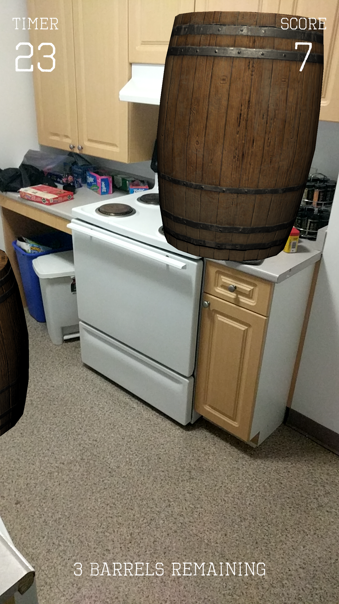

# Project 4: Barrel Bouncer AR Edition

**Due:** Tuesday, November 19, 2019 at 4:59:59 AM EST

In this project, you will be building upon your previous two projects to transform Barrel Bouncer into an AR experience, where the balls and barrels will collide and interact with the real world. This project is intended to give you some hands-on practice with using AR Foundation to implement some of the concepts we learned in class, like plane detection, lighting estimation, and occlusion, as well as creating a full, cohesive app with beginning, middle, and ending scenes.

## About AR Foundation

A few years ago, Apple and Google introduced ARKit and ARCore, new platforms for building augmented reality experiences for iOS and Android, their respective mobile operating systems. Both ARKit and ARCore had their own SDKs that allowed developers to take advantage of the platform's features. They did many of the same things, however, creating an AR app for both platforms meant that you had to have two different codebases and deal with two different SDKs. AR Foundation is Unity's cross-platform augmented reality API that aims to solve this problem. The API essentially serves as a wrapper to the equivalent functions in the ARKit and ARCore SDKs so that you can have a single codebase for your AR apps. Currently, it supports both smartphone platforms, but it also aims to support wearable AR (like HoloLens and Magic Leap) in the near future. Below is a graphic that summarizes what AR Foundation does.


For this project we will be using AR Foundation 3, which is still in preview. Note that if you search for or refer to documentation, you should make sure that you're looking at the documentation for AR Foundation 3, not AR Foundation 1 or 2. This can be found at: https://docs.unity3d.com/Packages/com.unity.xr.arfoundation@3.0/manual/index.html. You may also find the [AR Foundation Samples](https://github.com/Unity-Technologies/arfoundation-samples) project useful to refer to during this project.

## Instructions

At a high level, these are the main tasks that this project involves. Read below for more detailed information about each.

- Remove parts of project that are no longer necessary.
- Set up your project and scene for AR.
- Design a setup mode that detects and visualizes planes, sets up planar occlusion, and lets you place barrels into your environment.
- Create a play mode that lets you throw balls from the center of your camera against the clock as you gain points for destroying barrels.
- Develop a scene to capture your facial reaction with a wooden barrel filter and share your score with friends.
- Utilize scene management to move between different parts of the app.
- Build and deploy your project to a compatible ARCore or ARKit smartphone for testing.
- Use Git to create a zip file of the your project and submit it via ELMS.

### Make a Backup (Optional)

We strongly recommend that you make a back up of your project 3 before proceeding. If you _correctly_ generated your zip file for your last submission, that should suffice as a backup.

### Removing Unnecessary VR Environment, Items, & Settings

- In the project window, delete the following items:
  - the _**GoogleVR**_ folder
    - You may get an error that says that the folder contains a plug-in that cannot be unloaded while the Editor is running. If this happens, you may have to close out of the Editor and manually delete it using your operating system's file explorer (as well as the _**GoogleVR.meta**_ file, which is stored as a hidden file).
  - the _**DaydreamElements**_ folder
  - the tooltips prefabs
  - the _**Scenes**_ folder (assuming that is where you saved your scene)
    - We'll be starting from scratch with new scenes, so this will clear out your previous scene as well as the baked lighting and occlusion data you generated for it.
  - your terrain asset
  - the additional terrain tools samples (if you downloaded them from the Asset Store during project 2)
    - They should be located in the _**Samples**_ folder
- If you added the additional terrain tools via the package manager, you should remove that as well. To access the package manager, go to the menu bar and select `Window` -> `Package Manager`.
- In the Build Settings, remove all the scenes from the build, since they have been deleted and you won't be using them anymore.
- In the Player Settings, unselect the _**Virtual Reality Supported**_ checkbox.
- On the menu bar, go to `File` -> `New Scene` to create a new scene. Do not save the old scene again.
- Comment out or fix any errors in your scripts that were caused by the removal of the Google VR SDK.
- Close your project and restart the Unity Editor to disable any plug-ins that may not have been unloaded.

### Installing AR Foundation

The next step is to install AR Foundation via the Package Manager. Since we will be using AR Foundation 3 and it has not been officially released yet, we will need to set the package manager to show preview packages. As of this writing, the latest AR Foundation 3 version available is `preview.4 - 3.0.0`, but feel free to use a later 3.0 version if one is released by the time you work on this project.

- On the menu bar, go to `Window` -> `Package Manager`.
- In the new window that pops up, go to the _**Advanced**_ dropdown menu and check _**Show preview packages**_ if it isn't already selected.
- For each of the following items, expand their row, click on "See all versions", select `preview.4 - 3.0.0` or later, and then click install.
  - _**AR Foundation**_
  - _**AR Subsystems**_
  - _**ARCore XR Plugin**_
- If you intend to build and test your app on an iOS device, complete the previous step for the following two packages as well:
  - _**ARKit XR Plugin**_
  - _**ARKit Face Tracking**_
- Scroll all the way to the bottom and find the _**XR Management**_ package that was automatically installed when you added AR Foundation. Then update it to the latest stable version (`3.0.3` or later).

You may be wondering why there's two separate ARKit packages we have to import or why we aren't importing a "Face Tracking" package for ARCore, especially since we'll be using face tracking in this project to capture reactions to your score. Unity explains the reasoning behind this as follows:

- _"Apple's App Store will reject an app that contains certain face tracking-related symbols in its binary if the app developer does not intend to use face tracking, so we've broken out face tracking support into a separate package to avoid any ambiguity."_

Google does not have this restriction on the Play Store, hence why there is just a single ARCore XR Plugin for AR Foundation that contains all of the supported ARCore features, including face tracking.

### Setting the Player Settings

Since we will be testing your submission on Android phones, you are only required to set the Android player settings. However, if you plan on testing the app on your own iOS device, you should set the appropriate iOS player settings as well.

#### Android

Begin with the usual routine of changing the following:

- **Product Name:** Last_First_BarrelBouncer_AR
- **Package Name:** com.Last.First.BarrelBouncer.AR

You should also already have the following player settings enabled from project 3:

- **Graphics APIs:** (Vulkan removed from list, since not supported by Unity for XR applications)
- **Multithreaded Rendering:** ✔
- **Minimum API Level:** Android 7.0 'Nougat' (API Level 24)
  - This is the earliest version of Android that supports ARCore.
- **Scripting Backend:** IL2CPP

We want this app to run in standard portrait orientation only. To do this, go to the _**Resolution and Presentation**_ section and change the _**Default Orientation**_ setting to "Portrait".

Finally, you may have noticed that the _**XR Settings**_ section of the _**Player Settings**_ contains a checkbox for _**ARCore Supported**_. This should NOT be selected. If you select this, you will get the following error when you try to build your apk:

```
BuildFailedException: "ARCore Supported" (Player Settings > XR Settings) refers to the built-in ARCore support in Unity and conflicts with the "ARCore XR Plugin" package.
```

#### iOS

Change the following settings in the _**Other Settings**_ section:

- **Bundle Identifier:** com.Last.First.BarrelBouncer.AR
  - This is the iOS equivalent of Android's Package Name
- **Target minimum iOS version:** 11.0
  - This is the earliest version of iOS that supports ARKit.
- **Requires ARKit support:** ✔

The following settings should already be set for you:

- **Camera Usage Description** (Other Settings section)
  - The default message `Required for augmented reality support.` is automatically generated on there when you select the option for "Requires ARKit support".
- **Default Orientation** (Resolution and Presentation section)
  - This is one of the few settings that is shared between multiple platforms, and thus was already changed to Portrait orientation when you changed this setting in the Android player settings.

### Setting Up Your Scene for AR Foundation

First, delete the _**Main Camera**_ gameobject that was automatically added to your scene. You will not need this, since you will add another camera during the setup process that already has the settings and components required for AR applied to it.

Next, go to the menu bar, navigate to `GameObject` -> `XR`, and add an _**AR Session**_ and an _**AR Session Origin**_ to your scene.

The _**AR Session**_ gameobject contains two components:

- [AR Session](https://docs.unity3d.com/Packages/com.unity.xr.arfoundation@3.0/manual/index.html#arsession)
  - This component controls the lifecycle of an AR experience (i.e. enabling and disabling AR tracking) and keeps track of the current state of the session (i.e. whether the device is supported, if AR software is being installed, whether the session is working, etc.).
- [AR Input Manager](https://docs.unity3d.com/Packages/com.unity.xr.arfoundation@3.0/manual/index.html#ar-input-manager)
  - This component is necessary for enabling world tracking.

The _**AR Session Origin**_ gameobject contains a single component called [AR Session Origin](https://docs.unity3d.com/Packages/com.unity.xr.arfoundation@3.0/manual/index.html#arsessionorigin), whose purpose is to transform trackable features (such as planar surfaces and feature points) into their final position, orientation, and scale in the Unity scene. By default, the origin (coordinate (0,0,0)) of the coordinate system is set based on the initial location of your phone at the beginning of the current AR Session.

The _**AR Session Origin**_ gameobject also includes a single child gameobject called _**AR Camera**_, which contains three additional components (in addition to the default Camera component):

- [AR Pose Driver](https://docs.unity3d.com/Packages/com.unity.xr.arfoundation@3.0/manual/index.html#tracked-pose-driver)
  - This component drives the camera's local position and rotation according to the device's tracking information, which allows the camera's local space to match the AR "session space".
  - Note that the link above takes you to the documentation for the _**Tracked Pose Driver**_ component. The Tracked Pose Driver is a part of Unity's XR APIs that allows you to track the position and rotation of various devices, including VR headsets, controllers, and phones. The _**AR Pose Driver**_ seems to be new in AR Foundation 3, but is likely just the same thing with the settings already pre-configured to work best for a smartphone AR setup. Unity probably has just not updated the documentation to reflect this change yet, since it is still in preview.
- [AR Camera Manager](https://docs.unity3d.com/Packages/com.unity.xr.arfoundation@3.0/manual/index.html#ar-camera-manager)
  - This script enables camera features, such as textures representing the video feed and controls light estimation modes.
- [AR Camera Background](https://docs.unity3d.com/Packages/com.unity.xr.arfoundation@3.0/manual/index.html#ar-camera-background)
  - This component takes your phone's camera feed and applies it to the app's background each frame, essentially enabling you to see the image that the camera is currently capturing on your phone's screen.

You should also label the _**AR Camera**_ gameobject with the tag _**MainCamera**_.

At this point, if you build and test your app, you should be able to see the camera stream.

### Importing Other Resources

For a lot of the UI aspects of this app, we will be using TextMesh Pro as opposed to the default text. To learn about the benefits of using TextMesh Pro, check out [this blog post](https://blogs.unity3d.com/2018/10/16/making-the-most-of-textmesh-pro-in-unity-2018/). To import it into your project, go to the menu bar and navigate to `Window` -> `TextMeshPro` -> `Import TMP Essential Resources`.

Next, you should import a set of assets that we've created for your use in this project, found in the `Project4NewAssets.unitypackage` file in this folder.

### Adjusting for Environment Lighting

On your _**AR Camera**_ gameobject, find the _**AR Camera Manager**_ component and change its _**Light Estimation Mode**_ setting to _**Ambient Intensity**_.

Our unitypackage contains an unfinished _**Lighting Estimation**_ script. Go ahead and add it to your _**Directional Light**_ gameobject and drag the _**AR Camera**_ gameobject into the its reference to the _**Camera Manager**_. Then open it up in your favorite code editor and find the FrameChanged function. This is where you will be modifying the properties of the directional light to match the the light estimation data, including the brightness, color temperature, and color correction values if they are available. Note that you may find the documentation for [ARCameraFrameEventArgs](https://docs.unity3d.com/Packages/com.unity.xr.arfoundation@3.0/api/UnityEngine.XR.ARFoundation.ARCameraFrameEventArgs.html), [ARLightEstimationData](https://docs.unity3d.com/Packages/com.unity.xr.arfoundation@3.0/api/UnityEngine.XR.ARFoundation.ARLightEstimationData.html), and [Light](https://docs.unity3d.com/ScriptReference/Light.html) helpful for this part of the project, as well as the Lighting Estimation scene in the AR Foundation samples.

### Enabling Plane Detection, Visualization, and Occlusion

Go to your _**AR Session Origin**_ gameobject and add the _**AR Plane Manager**_ component to it. You will notice that it has two properties that you can set: _**Plane Prefab**_ and _**Detection Mode**_. The former is the reference to the prefab that the plane manager should use to visualize the planes it detects. The latter defines what types of planes (i.e. horizontal, vertical) the plane manager should be tracking.

Let's create the plane prefab. On your menu bar, go to `GameObject` -> `XR` -> `AR Default Plane`. This will create a new gameobject that defines the plane's visualization to look like this:


However, we want the planes in our game to look a little nicer, perhaps something like this dotted pattern:


This example uses a material that is included in the AR Foundation samples, but isn't part of AR Foundation itself. Unity calls this a _"feathered plane"_. This is because the material fades out towards the edges of the plane. According to [this link](https://whatis.techtarget.com/definition/feather), the term feathering refers to:

- _"In graphic design, to feather is to soften an edge of an image by making the edge gradually fade out until it becomes transparent. In computer graphics, feathering blurs the edges of an image by building a transition boundary between the selection and its surrounding pixels. Because feathering is set by a radius measurement in pixels, the feathering occurs on both sides of the selection boundary."_

In addition to prettying up our plane visualizations, we also need to have our planes follow occlusion, something that the default plane does not account for. Once again, the AR Foundation samples accomplishes this through a material they've included in the sample project that isn't a part of AR Foundation itself. This transparent material blocks out all objects that are behind the object it is applied to, except for the scene's background that shows the camera feed. We have included both the feathered plane and occlusion shaders and materials for you to use as part of the provided unitypackage.

On your _**AR Default Plane**_ gameobject, find its _**Mesh Renderer**_ component, expand its _**Materials**_ section and change the size of the array to 2. Drag the _**FeatheredPlaneMaterial**_ into the first element and the _**OcclusionMaterial**_ into the second element (both can be found in the _**Materials**_ folder in your project window). Next, remove the _**Line Renderer**_ component from the gameobject (since the default visualization draws a black line around the planes' boundaries, but we don't want that in ours) and add the _**AR Feathered Plane Mesh Visualizer**_ script to it (this helps ensure that the feathering effect only occurs towards the planes' boundaries).

Once you have done these steps, drag the gameobject into the project window to make a prefab out of it, and then delete the instance from your scene. You may rename the prefab for clarity, if you would like. Finally, set it as the _**Plane Prefab**_ that should be used for visualizations by dragging it into the appropriate slot on the _**AR Plane Manager**_.

### Placing the Barrels

The next step is to place barrels into your environment, similar to what you did in project 2. When your user taps on the screen, you should raycast to the point on the screen that the user touched, and if it hits a plane, a barrel should be instantiated in an upright position (i.e. not sideways) at a position where its bottom side is 0.2 meters above the collision point, so that it falls onto that point. The documentation for raycasting in AR Foundation can be found [here](https://docs.unity3d.com/Packages/com.unity.xr.arfoundation@3.0/manual/index.html#raycasting).

Note that you may have to resize your barrel prefab if the barrels seem too large or too small in the real world. Additionally, it's possible that a barrel falls over the edge of the plane and free falls infinitely, either during initial placement (i.e. if it falls onto place but loses balance) or when a plane drifts due to a loss in tracking or an updated understanding of the world. Thus, you should destroy the barrel if it appears to be free-falling in this mannner. One way to do this could be to delete the barrel if it reaches a ridiculously low y-coordinate, such as -500. Finally, you should keep track of the number of barrels that are currently in your space, since this will be a useful point of information in the next sections.

### Creating the UI

The plane detection and barrel placement will compromise the setup mode. Once the user has completed setup, they should move into a gameplay mode, where they will be throwing the balls. Hence, they should have a button on their screen that allows them to finish the setup mode and advance to the gameplay mode. The button should be located towards the bottom center of the screen and should follow the same thematic and font styling as the rest of the app. See the scenes described in [this section](#putting-together-the-pieces) for some example UIs.

The gameplay mode should also have a UI. The upper left corner should have a timer that counts down from 30 seconds. The upper right corner should display your current score, which starts at 0 and increases by 1 every time you hit a barrel. The bottom of the screen should display the number of barrels remaining (i.e. "5 barrels remaining", "1 barrel remaining", etc.). Once again, these should use the same font style as the rest of the app.

For both UIs, you should take advantage of anchor presets and positioning to ensure that the UI positioning stays consistent across a variety of phone screen sizes. Below are some screenshots that depict what your final UIs should look like.

| Setup UI | Gameplay UI |
| ------------- | ------------- |
|  |  |

### Throwing the Balls

In this project, you will be throwing the balls in a similar way that you did in project 2. When a user taps the screen, a new ball should be created and thrown from the center of the phone's camera in the direction that the phone is facing. The ball should still follow all of the same behaviors from the previous projects (i.e. destroying itself 5 seconds after being thrown, destroying barrels upon impact, having a bouncy behavior, correctly utilizing all 3 spatial audio effects).

Additionally, you should keep track of the barrels, score, and time, and appropriately edit the text in the UI to reflect changes. Finally, when the timer runs out or when there are no more barrels left to destroy (whichever comes first), you should advance to the _**GameOver**_ scene, which is described in the next section.

### Putting Together the Pieces

We have created an _**Intro**_ scene and a _**GameOver**_ scene that contains the UIs the user should see before and after gameplay. You may have to change the resolution on your Game view Control Bar to be 1920x1080 Portrait or higher in order to properly see how the UI looks. It is your task to use scene management to enable navigation between these scenes, similar to what was accomplished in the Shark Runner project. Note that you will have to add each of the scenes to your build in order for the scene management functions to work properly. You should also have the _**Intro**_ scene be listed at the top, since it is the initial scene that should load when you launch the app.

### Capture Your Reaction and Share With Friends

You may have noticed that that there is a "React & Share" button in the _**GameOver**_ scene. This button should take you to a new scene that captures a screenshot of your reaction with a wooden barrel filter applied to your face and then lets you share that screenshot on social media or with friends. Go ahead and create this new scene, set it up for use with AR Foundation, save it, and add it to the build.

To have it recognize your face, you should add the _**AR Face Manager**_ component to your _**AR Session Origin**_ gameobject. You will notice that it has two properties that you can set: _**Face Prefab**_ and _**Maximum Face Count**_. The former is a reference to the prefab that the face manager should overlay over the faces it detects.

Let's create the face prefab. On your menu bar, go to `GameObject` -> `XR` -> `AR Default Face`. This will create a new gameobject that defines a green filter over your face. We want to change it to have a more wooden barrel-like effect. We already have a wooden background image that can serve as the basis of the filter. All we have to do is create a new material, drag the image into the small square box to the left of its _**Albedo**_ property, and then drag that new material into the _**Materials**_ section of the _**Mesh Renderer**_ component of your _**AR Default Face**_ gameobject. Next, drag the gameobject into the project window to make a prefab out of it, and then delete the instance from your scene. You may rename the prefab for clarity, if you would like. Finally, drag this prefab into the _**Face Prefab**_ slot on the _**AR Face Manager**_.

Your scene should now be able to apply a barrel filter over your face. Next, you should create a UI that looks something like this:


The final part is to actually capture the screenshot and share it with friends. You should make sure that you are saving the screenshot with a unique filename, so that the screenshots are not overwritten on subsequent runs of the scene. In order to implement the sharing aspect, you should utilize [this plugin from the asset store](https://assetstore.unity.com/packages/tools/integration/native-share-for-android-ios-112731) that will open up your operating system's native sharing manager. Once you have shared the file, your app should return to the main menu scene.

### Bonus Tasks (Optional)

Congrats! You have now finished creating your very first AR game from scratch and have hopefully learned a lot along the way. Nevertheless, there is still a lot you can do to improve your app's experience, if you're up for the challenge. Below are a few suggestions.

#### Improve Setup Experience with Animations

Currently, there is not much instruction on what users should do in the setup scene, which could leave them confused. Luckily, we follow a common approach to setup, and the AR Foundation Samples has contains a scene called _**SampleUXScene**_ that plays some animations to guide the user on what they should be doing, something we could do in our app as well.


Go ahead and add these same animations to your scene. Similar to what you did in project 3 with the Daydream Elements project, you should inspect this scene to determine what assets you will need to port over in order to get these guided setup animations to work.

#### Better Scoring Mechanics

Currently in your project, you are just increment the score based on the number of barrels you hit. However, many games have more robust scoring systems that incentivize you in multiple ways, such as speed and resource usage. Devise and implement your own scoring mechanism: one that takes into consideration the speed at which you completed the game, the number of barrels you destroyed, the number of balls you used, and "combos" (e.g. if you have a single ball destroy multiple barrels, the points gained for each subsequent barrel after the first grow exponentially). Make sure to update the instructions on the Intro scene to reflect your new rules.

#### People Occlusion

With the announcement of iOS 13 and ARKit 3 in June, Apple introduced people occlusion to its augmented reality platform. Below is a video that shows just how well it works in action.

Add this feature into your project as well. You may find the scenes in the Human Segmentation folder of the AR Foundation Samples helpful when implementing this. Note that you will need an iOS device with an A12/A12X/A13 Bionic chip and the Apple Neural Engine to test this out.

[](http://www.youtube.com/watch?v=vkS-VqAss4s)

## Submission Details

Your submission to ELMS should consist of the following 2 files:

- `Last_First_BarrelBouncer_AR.zip`
- `Last_First_BarrelBouncer_AR.apk`

**Make sure to use Git to zip your project**. The basic steps involve initializing a new repo, adding and committing all your changes, and using archive to create the zip file. Additionally, make sure that the apk file you submit is not a development/debug build. If you need a refresher on how to generate either of these two files, please refer to the [Project 0 Instructions](https://github.com/cmsc388M/fall19/tree/master/project0).
